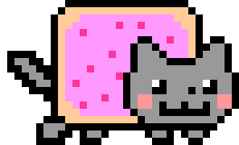
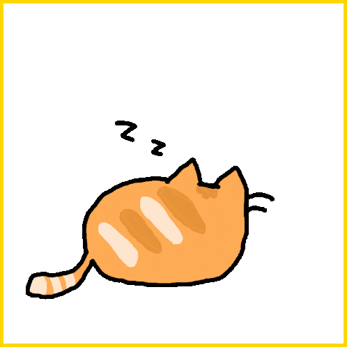

<p align="center">
  
</p>

<h1 align="center">Nyan Progress Bar — Website</h1>

<p align="center">
  Marketing and support site for the <strong>Nyan Progress Bar</strong> Chrome extension.<br/>
  Replace the YouTube progress bar scrubber with animated cats.
</p>

<p align="center">
  <a href="https://chromewebstore.google.com/detail/nyan-cat-extension/oadlabdleegopgjlkcmjjogeaceagbie">
    
  </a>
  <a href="https://chromewebstore.google.com/detail/nyan-cat-extension/oadlabdleegopgjlkcmjjogeaceagbie">
    
  </a>
  <a href="https://chromewebstore.google.com/detail/nyan-cat-extension/oadlabdleegopgjlkcmjjogeaceagbie">
    
  </a>
</p>

---

## About

The **Nyan Progress Bar** Chrome extension replaces YouTube's boring scrubber with one of 12 animated cat GIFs, adds a rainbow trail, and lets you fine-tune the height and position via a live customizer in the popup. This repo is the companion website — built with Next.js 16, FSD architecture, Tailwind CSS v4, and 10 localised languages.

| | |
|---|---|
| **Extension** | [Chrome Web Store](https://chromewebstore.google.com/detail/nyan-cat-extension/oadlabdleegopgjlkcmjjogeaceagbie) |
| **Extension repo** | [`/nyan-plugin-youtube`](https://github.com/pryvalovbogdan/nyan-plugin-youtube) |
| **70 K+** installs | **4.7 ★** rating · 58 reviews |

### Cat themes

<p>
  
  
  
  
  
  
  
  
  
  
  
  
</p>

---

## Stack

| | |
|---|---|
| Framework | Next.js 16 (App Router) |
| Language | TypeScript (strict) |
| Styling | Tailwind CSS v4 + Shadcn/UI |
| Architecture | Feature-Sliced Design (FSD) |
| State | Zustand |
| Email | Nodemailer (Gmail SMTP) |
| i18n | 10 locales — en, es, pt, fr, de, uk, pl, vi, id, tl |
| Theme | next-themes (dark-first) |

---

## Project structure

```
src/
├── app/           # Next.js routing — thin page files + locale segment [lang]
├── views/         # Full-page compositions (HomeView, ExtensionView, …)
├── widgets/       # Header, Footer, StatsSection, ReviewsSection, ScrubberPreview
├── features/      # cat-selector, customizer, contact-form
├── entities/      # CatEntry types + catsData registry
└── shared/        # ui primitives, lib (mailer, rateLimit, metadata), dictionaries
```

## Getting started

```bash
# 1. Install dependencies
npm install

# 2. Copy env template and fill in your SMTP credentials
cp .env.local.example .env.local

# 3. Copy GIF assets from the extension repo
npm run copy-assets

# 4. Start the dev server
npm run dev
```

Open [http://localhost:3000/en](http://localhost:3000/en).

## Environment variables

| Variable | Description |
|---|---|
| `NEXT_PUBLIC_SITE_URL` | Public URL of the deployed site (used for sitemap + OG) |
| `SMTP_HOST` | SMTP server hostname (default: `smtp.gmail.com`) |
| `SMTP_PORT` | SMTP port (default: `587`) |
| `SMTP_USER` | Gmail address used to send emails |
| `SMTP_PASS` | Gmail app password |
| `CONTACT_TO` | Email address that receives contact form submissions |

## Scripts

```bash
npm run dev           # copy assets + start dev server
npm run build         # copy assets + production build
npm run copy-assets   # copy GIFs from ../../assets/ → public/cats/
```

## Deploy

Recommended: **Vercel** (zero-config for Next.js App Router).

1. Push to GitHub
2. Import the repo at [vercel.com](https://vercel.com)
3. Add all env vars from the table above in the Vercel dashboard
4. Deploy

## License

MIT
